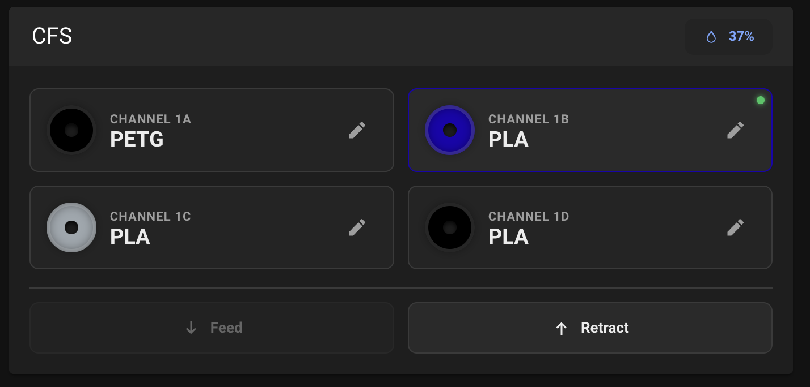

# K1C CFS Mainsail Integration

This project adds a simple CFS panel directly inside Mainsail on the Creality K1C.



It also includes a mobile app for editing CFS filaments and spool colors.

## Requirements

Before using this project, the printer must already have:

- root access enabled
- Creality Helper Script installed
- Mainsail installed and working

With it, you can:
- see the four CFS channels inside Mainsail
- view filament type, humidity, and temperature
- edit filament information
- start `Feed`, `Switch`, and `Retract` directly from the panel
- follow printer-side actions with button lock and loading indicators
- use the mobile app to register printers, edit filaments, and capture spool colors

## How It Works

The integration injects a small panel into the Mainsail page already running on the printer.

After installation, the panel appears inside:

- `http://PRINTER_IP:4409/`

If the page is already open, just refresh the browser once.

## Installation

Clone the repository on the printer:

```sh
git clone https://github.com/HimAndRobot/creality-cfs-mainsail-integration.git
cd creality-cfs-mainsail-integration
chmod +x ./menu.sh
./menu.sh
```

Then:

1. Press `1` for `Install`
2. Wait for the script to finish
3. Press `Enter`
4. Refresh Mainsail in the browser

## Removal

Run the menu again:

```sh
cd creality-cfs-mainsail-integration
./menu.sh
```

Then:

1. Press `2` for `Remove`
2. Wait for the script to finish
3. Press `Enter`
4. Refresh Mainsail in the browser

## Notes

- The panel is loaded directly inside Mainsail
- If you do not see the panel after install or remove, refresh the browser

## Mobile App

The repository also includes an Expo app in:

- `app/`

With the app, you can:

- add multiple printers by name and IP
- connect directly to the printer WebSocket
- view CFS slots in real time
- edit filament information
- choose a color manually or capture it with the camera

To run it:

```sh
cd app
npm install
npm start
```

Then open it in Expo Go on your phone.
